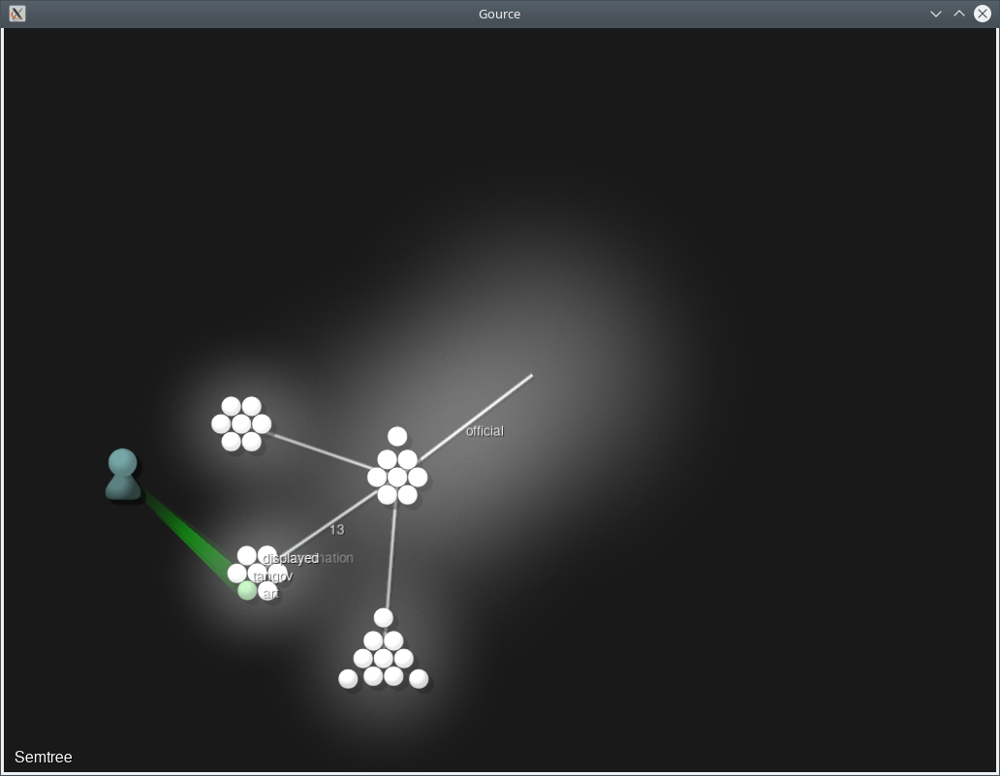

# Semantic Tree


This package provide a semanticTree command, which generates a visualization of the semantic neighborhood of a work in a Gensim Word2vec vector space.


## Installation


This package requires that [Gource](https://gource.io/) is installed locally. On Ubuntu, it can be apt installed.

```bash
$ apt install gource
```

SemanticTree itself can be installed from PyPI with `pip`.

 ```
 pip install -U semantic_tree
 ```


## Note


This project has been set up using PyScaffold 3.2.3. For details and usage
information on PyScaffold see https://pyscaffold.org/.
